# About


## Overview
This Readme provides an overview of the functionalities of the Interactive Human-Machine (IHM) application.

## Project Introduction
The project focus on enhancing the ergonomics of a website. Angular is employed as the primary frontend framework for development. The main goal of the project is on advancing the frontend, and as such, no backend is utilized. All data within the application is mock data.

# How to run

Branch in Use: `main`

To run the application, follow these steps:

```
cd frontEnd/front
npm install
npm start
```

Go to http://localhost:4200/ on a web Browser to see the result.

The application is also deployed online for user testing. You can access it at the following link:
> https://ihm-testing.netlify.app/

Link to the demo:
https://drive.google.com/file/d/10WbF8tCrQ9LMPD7AV3iT8IdcEj-jggfp/view?usp=sharing

# Functionality


### Overview
The application's functionalities are structured. Functionality implementation is kept minimal, primarily serving as illustrative elements to showcase the overall appearance of the website. These functionalities can be easily modified to apply the backend. 

- **Header**: The header section remains constant across all pages, providing a consistent navigation experience.
- **Body**: The body section dynamically changes based on the route of the web page. It serves as the main content area where different functionalities are displayed.
- **Footer**: Similar to the header, the footer section is consistent throughout the application, offering additional information or links.


## 1. Header

Including a Banner and a Navbar

- **Banner**:
    - The banner's introduction message adjusts based on the user's login status. If the user is logged in, a personalized greeting or message is displayed. If the user is not logged in, a default message or prompt is shown.
    - The toggle button enables users to switch between English and French languages. Clicking the toggle button updates all the content of the website in the selected language.
    


- **Navbar**:
    - Clicking on the logo navigates the user back to the home page.
    - The item list dynamically adjusts based on the user's login status.
        - Home/Accueil: Navigates to the homepage.
        - Log in/Se connecter: Takes the user to the login page.
        - Data and Modeling/Données et Modélisation: Takes the user to the modeling section.
        - Settings/Paramètres: Directs the user to the settings page.
        - Log out/Se déconnecter: Logs the user out of the current user session.

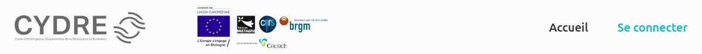

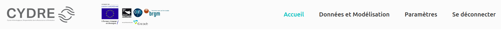

## 2. Body

The application consists of the following routes:

### /home

- Nothing special

### /login

- The login route provides a simplified login interface without the need for entering a username or password. Users can click the "Soumettre/Submit" button to log in and gain access to the project's functionalities (Modeling, Settings).

    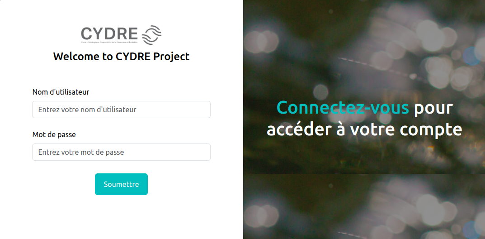


### /modeling

- A selection box allowing users to choose a "bassin"

    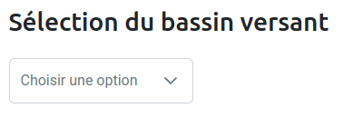

- Below, there are five tabs representing different functionalities:

    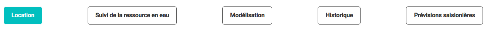
    - ***Location***: 
        - Toggle Button: Show limit (Illustration)

            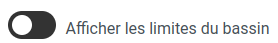
        - Map: Users can zoom in, zoom out, and move the map freely. The current location is fixed and does not correspond to the selected "bassin" (Illustration)

            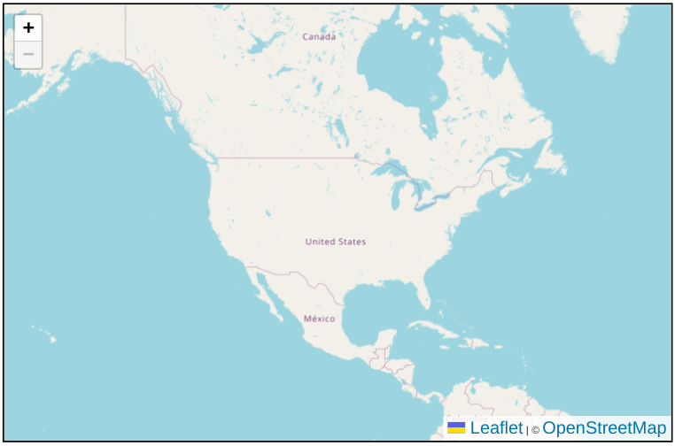
    -  ***Suivi de la ressource en eau***:
        - A graph containing mock data. Users can click on data points to view specific values

            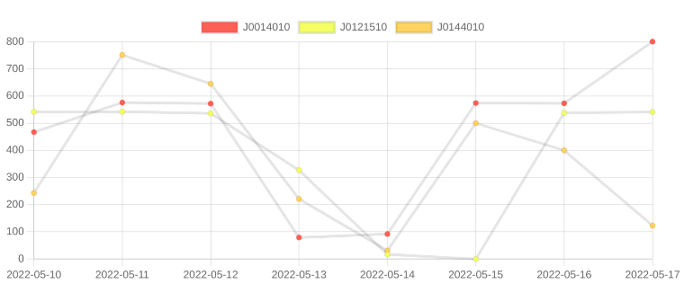
    - ***Modelisation***:
        - Selection button: Select an xml file (Illustration)
        - Launch button: To next step
        
            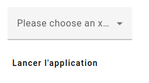
        - A nest: Users can modify values using sliders or by entering values manually (Illustration)
        - Back Button: Allows users to return to the previous step
        
            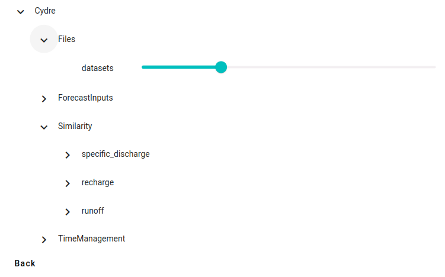
        - Users can also select step from the bar above to navigate between different steps

            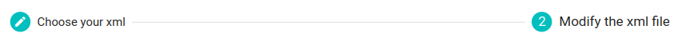
    - ***Historique***:
        - This tab contains a table with mock data (Illustration)

            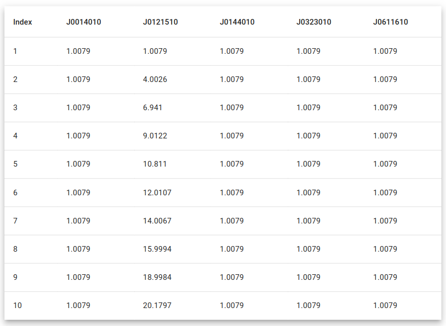
    - ***Prevision***:
        - Prediction button: predict value (Illustration)

            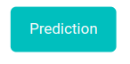
        - After clicking the prediction button, a progress circle appears to indicate loading (Illustration)
        
            


### /settings
- Upload image button: Allows users to upload an image for their profile (Illustration)

    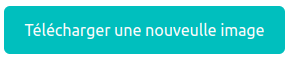
 
- Form Fields: Users can update their information using the provided forms

    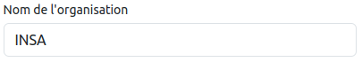
    
- Save Button: Clicking the "Save" button will store the changes made.
- Discard Button: Clicking the "Discard" button will cancel any modifications made.

    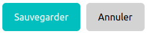
